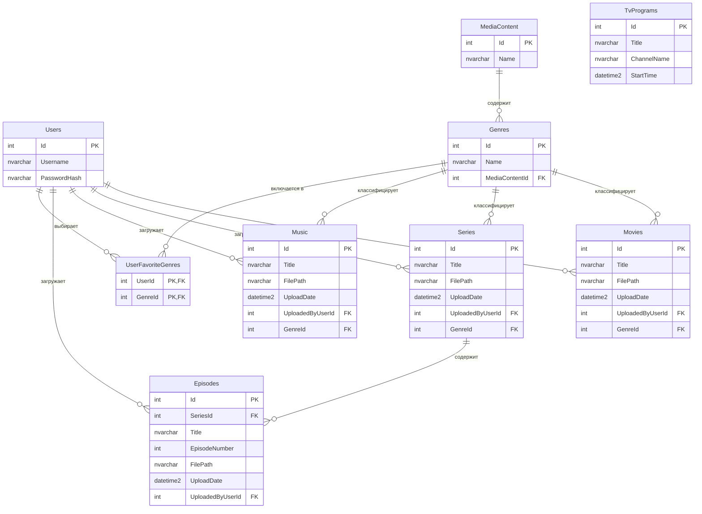

# Hoshiko Media

Настольное приложение на платформе WPF (Windows Presentation Foundation) с архитектурой MVVM для управления медиаконтентом (музыка, фильмы, сериалы) и отображения программы телепередач. Проект использует Entity Framework для взаимодействия с СУБД SQL Server.

---

## Архитектура базы данных

Ниже представлена структура таблиц и связей в формате Mermaid.

---

## Установка и запуск

### Сборка из исходного кода
Для ручной сборки необходима среда разработки Visual Studio 2022 с установленной рабочей нагрузкой "Разработка настольных приложений .NET".

### Скачивание готовой версии
Чтобы скачать готовую сборку приложения:
1. Перейдите в раздел **Releases** на GitHub.
2. Скачайте последнюю доступную версию (там будет представлен ZIP-архив).
3. Распакуйте содержимое архива в удобную папку на жестком диске.

---

## Инструкция по эксплуатации

1. **Подготовка базы данных**  
   Обязательно перед работой выполнить все скрипты из папки `db` на вашем экземпляре SQL Server. Скрипты автоматически развернут базу данных HoshikoDB, создадут таблицы и заполнят их тестовыми жанрами и файлами.

2. **Запуск программы**  
   Запустите файл `Hoshiko.exe` из папки с приложением.

3. **Авторизация**  
   Для входа в систему используйте следующие демонстрационные учетные данные:
   * **Логин:** byak
   * **Пароль:** 123456

4. **Просмотр контента**  
   Все функции приложения находятся во вкладках («Музыка», «Фильмы», «Сериалы», «Телепередачи», «Жанры»). При переключении между ними на экране будут отображаться интерактивные таблицы со списками контента, кнопками управления и блоками рекомендаций.
